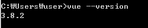

# Vue CLI

### CLI

> 명령 줄 인터페이스 (CLI, Command line interface)<br>
> 또는 명령어 인터페이스는 텍스트 터미널을 통해 사용자와 컴퓨터가 상호작용하는 방식을 뜻한다.<br>
> <위키백과>


Window 사용자들이 접하게 되는 CMD창과<br>
Mac사용자들이 접하는 Terminal창이 바로 명령 줄 인터페이스를 제공하는 프로그램.


<br>
<br>


### Vue CLI

- 커맨드라인 인터페이스 기반의 vue 프로젝트 생성 도구. 
- Vue 개발할때 기본적인 폴더 구조, 라이브러리등을 설정. 
- Vue.js Core 에서 공식적으로 제공 
- 애플리케이션 개발에 집중할 수 있도록 프로젝트의 구성을 도와주는 역할<br>

<br>
CLI사용은 선택사항이나, Vue.js 관련된 오픈소스들은 대부분 vue cli 를 통해<br>
구성이 가능하도록 되어 있고 굳이 git 으로 clone 받지 않아도 CLI 를 통해 쉽게 설치 가능하기에 추천함.<br>
<br>
툴, 스캐폴딩에 도움을 주는 역할이라고 생각하면됨.<br>

> 스캐폴딩이란<br>
>건설에서는<br>
비계(飛階)는 건설, 건축 등 산업현장에서 쓰이는 가설 발판이나 시설물 유지 관리를 위해 사람이나 장비, 자재 등을 올려 작업할 수 있도록 임시로 설치한 가시설물 등을 뜻한다.<br>
><br>
>교육 쪽에서는<br>
>교수자가 학생에 대하여 적절한 교수학습적 도움을 제공함으로써
>유의미한 학습을 수행할 수 있도록 하는 것으로 특히 학습자들로 하여금 자신의 현재 기능수준을 넘어서 다음 단계의 수준까지 이르도록 돕기 위해 제공되는 지원을 말한다.<br>
> <br>
> 개발쪽에서는<br>
> 작업(개발)을 용이하게 시작할 수 있는 발판을 제공해주는 것 정도로 해석

<br>

### Vue CLI3

CLI는 3.x 버전까지 릴리즈된 상태.

##### CLI3 설치
(npm  쓸거니.. 기본 node.js 깔려있어야 됨)
```
$ npm install -g @vue/cli
# or
$ yarn global add @vue/cli
```
설치하고 아래 명령어 실행하면
```
$ vue --version
```
3.x 설치된것 확인 가능 <br>


 

<br>


## CLI 3.X 와 2.X

2.x와 3.x 비교 설명

<br>

##### 설치

```
$ npm i -g @vue/cli // vue-cli 3.x
$ npm i -g vue-cli // vue-cli 2.x
```

<br>

##### 3.x에서 2.x 버전 템플릿 사용하기

3.x 이용해서 2.x 버전 템플릿을 사용하려면 @vue/cli-init 을 설치해야함.

```
$ yarn global add @vue/cli-init
# 이제 vue init 명령어를 사용할 수 있습니다.
$ vue init webpack my-project
```

<br>
##### 프로젝트 생성
2.x 버전에서는 eslint, unit test, night watch 등등 선택을 해야만 했음.<br>
3.x 에서는 default (babel, eslint) 를 선택하면 가장 기본적인 설정으로 프로젝트가 생성됨.(나중에 언제든지 옵션을 추가할 수 있습니다.)

```
$ vue create '프로젝트 명' // vue-cli 3.X
$ vue init webpack '프로젝트 명' // vue-cli 2.X
```

<br>
##### CLI2 명령어

- `vue init webpack` : 고급 웹팩 기능을 활용한 프로젝트 구성 방식. 테스팅, 문법 검사등을 지원.
- `vue init webpack-simple` : 웹팩 최소 기능을 활용한 프로젝트 구성 방식. 빠른 화면 프로토타이핑용.
- `vue init browserify` : 고급 브라우저리파이 기능을 활용한 프로젝트 구성 방식. 테그스팅, 분법 검사등을 지원
- `vue init browserify-simple` : 브라우저리파이 최소 기능을 활용한 프로젝트 구성방식. 빠른 화면 프로토 타이핑용
- `vue init simple` : 최소 뷰 기능만 들어간 HTML 파일 1개 생성
- `vue init pwq` : 웹팩 기반의 프로그레시브 웹앱 기능을 지원하는 뷰 프로젝트.

<br>

##### 서버실행

```
$ npm run serve // vue-cli 3.x
$ npm run dev // vue-cli 2.x
```

<br>

##### node_modules

- vue-cli 3.x - vue create를 통한 프로젝트 생성 단계에서 함께 설치됩니다.
- vue-cli 2.x - 프로젝트 생성 후 npm install을 통해 설치합니다.


<br>

##### 웹팩 설정 파일

- vue-cli 3.x 노출 X
- vue-cli 2.x 노출 O

<br>

2.x에서는 webpack.config.js 파일이 루트 디렉토리에 있음<br>
3.x에서는 웹팩 설정 파일이 숨겨져 있기때문에 설정을 추가하기 위해서는 루트 디렉토리에 vue.config.js 파일을 설정하고 내용을 작성해줌 <a href="https://cli.vuejs.org/guide/webpack.html#simple-configuration">3.x vue.config.js</a>

<br>

##### 프로젝트 구성

2.x 에서는 simple, webpack, webpack-simple, pwa 등 템플릿 리스트 중 하나를 선택해서 프로젝트를 구성했다면, <br>
3.x 에서는 프로젝트에 플러그인 기반으로 원하는 설정 추가합니다.

##### 언어
3.x : ES6기준<br>
2.x : ES5 기준(ES6 선택 가능)


##### GUI
3.x : GUI 툴 제공 (vue ui) <br>
2.x : x

