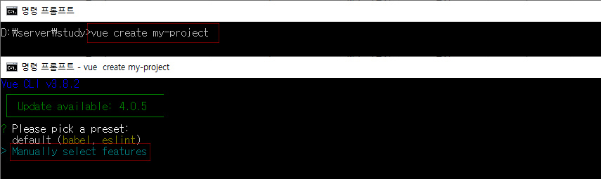
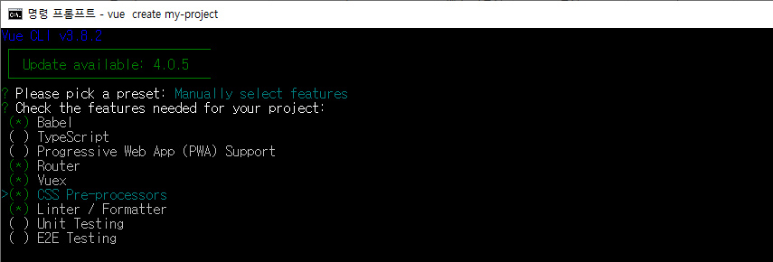
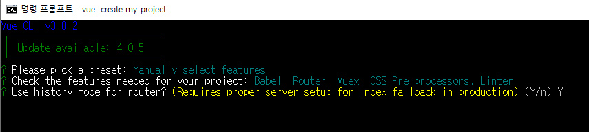
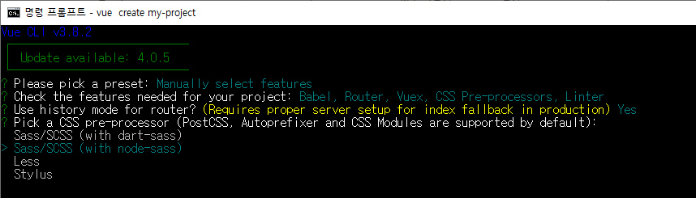
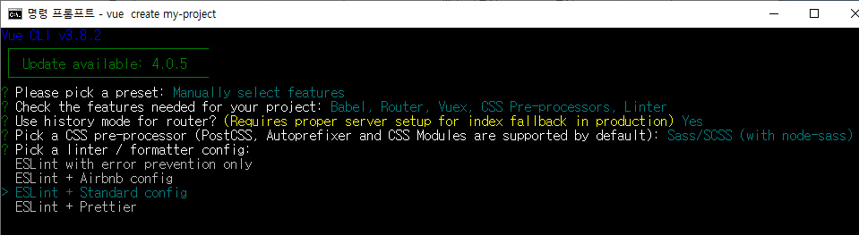
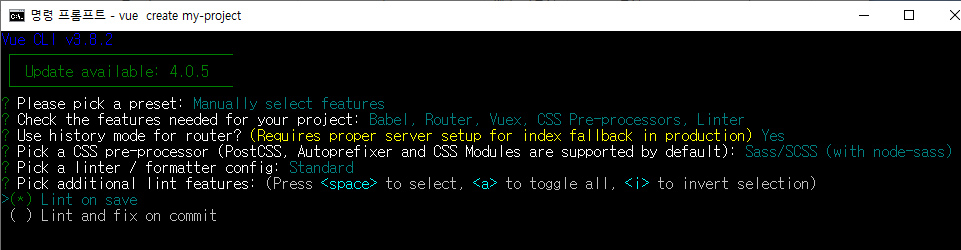
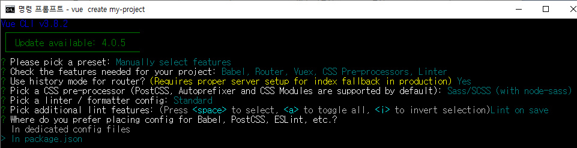
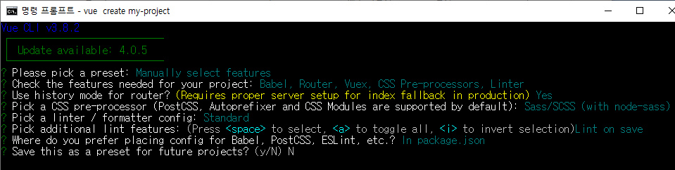
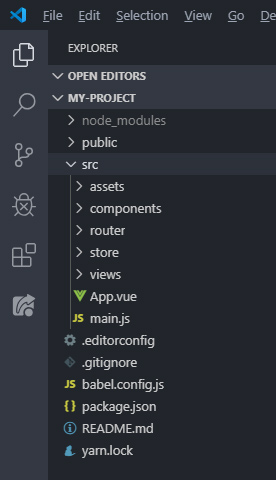
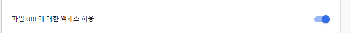

# Vue Create Project

### 개발 환경
- 크롬 브라우저 (필수)
- vscode 에디터 (필수)
- Node.js (필수)
- [뷰 개발자 도구](https://chrome.google.com/webstore/detail/vuejs-devtools/nhdogjmejiglipccpnnnanhbledajbpd) (필수 아니지만 한번은 설치해보시는게 조흠)


**vscode Vue 개발에 유용한 도구**<br>
마지막 Vue VSCode Snippets 요거 편합니다 깔아두세욤 'ㅁ' <br>
https://joshua1988.github.io/web-development/vuejs/boost-productivity/


<br>

## 프로젝트 생성
```
// my-project 는 프로젝트명(파일명)
$ vue create my-project
```

프로젝트 만들 위치에서 cmd 창에 위 명령어를 치면 아래 캡쳐처럼 나옴.<br>

<br>
default(babel, eslint)/ Manually select feature 두개중 하나 선택.<br>
`Manually select feature` 선택.<br>

- default (babel, eslint) : 말그대로 기본적으로 babel하고 eslint 설치되고 (선택 하면 바로 폴더 생성됨)
- Manually select feature : 은 vuex, vue-router등 몇가지 더 선택적으로 설치 가능.
<br>


<br>

<br>
Manually select feature로 선택하게되면 뭘 설치할건지 선택 가능하게 나옴.<br>


<br>
<br>
화살표키로 움직이고, space바 로 선택하면됨.<br>
- Babel
- Router
- Vuex
- Css Pre-~
- Linter ~ 
선택

<br>

프로젝트에 맞게 선택하고 enter 치면 아래와 같이 나옴<br>
Vue-Router 설치하겠냐 인데, router 는 거의 필수라 보면됨. (프론트엔드를 섞으실 생각이면 옵션끄고 Custom Router를 준비하것도 좋은 생각이라는데 모르니까 일단  `Y`)<br>

<br>

<br>
다음..  css 어떻게 쓸건지<br>
`sass - node` 선택하고<br>

<br>
<br>

다음 ESLint 항목. (ESLint 추가설명은 하단에 있습니다)<br>
어떤항목을 선택해도 ESLint 는 기본설치되고, 어떤룰을 적용할지를 선택하면됨.<br>
`Standard config` 선택함<br>

<br>
<br>

그리고나서 `Lint on Save` 선택 (lint and fix on  commit 은 git 저장소설정해야 작동한다고함.)<br>


<br>

다음.. `in package.json` 선택.<br>

<br>

마지막으로 여태 설정한거 저장해둘건지 선택 (저장해도 되고 안해도됨. 일단 - `N`)<br>

<br>
다하면 폴더 생성됨.

<br>

### 폴더 구조



- public/index.html : 애플리케이션 뼈대가 되는 html (마크업에서 건드리진 않음)
- src : 애플리케이션이 동작하는 데 필요한 로직이 들어갈 위치. <br>
ㄴ assets : 이미지나 애플리케이션에 사용되는 파일들 모여 있는 폴더<br>
ㄴ components : vue 컴포넌트들이 모여 있는 폴더 (마크업은 여기서. 거의 이 폴더만 건드린다고 생각하면됩니다.)<br>
ㄴ router : router 설정하는 폴더<br>
ㄴ App.vue : 가장 최상위 컴포넌트<br>
ㄴ main.js : 가장 먼저 실행되는 javascript파일. vue 인스턴스를 생성하는 역활.


<br>


### ESLint

EsLint에 대해서.. [잘 설명된 블로그](https://www.zerocho.com/category/JavaScript/post/583231719a87ec001834a0f2)를 간단하게 정리하자면..<br>
ES + Lint<br>
ES = EcamScript이고<br>
Lint 는 보푸라기라는 뜻이라함.<br>
즉 자바스크립트 문법중 에러가 있는 곳에 표시를 달아 놓는 도구. 라 생각하면됨.<br>
<br>
사용자가 정의한대로 코드 점검 + 에러가 있는 곳 표시 + 코딩 스타일도 정할 수 있음(협업할때 좋겠지)
<br>

이거 외에도 JSHint, JSLint, JSCS 등이 있으나 요즘에는 ESLint가 대세라함.
<br>
이유는 확장성이라는데.. 다양한 플러그인을 사용할 수 있기때문에 새로운 규칙을 추가할 수 있고 손쉽게 다른 회사나 사람의 설정을 도입할 수 있다함.
<br>


ESLint 관련 설정을 할때의 각각 옵션에 대한 설명..
- ESLint with error prevention only : 에러 일으키는 코드만 lint
- ESLint + Airbnb config : eslint랑 [airbnb 사의 코딩 스타일](https://github.com/airbnb/javascript)을 사용하겠다.
- ESLint + Standard config : 이거는 [Standard JS 코딩 스타일](https://standardjs.com/)
- ESLint + Prettier:  [Prettier](https://prettier.io/)


<br>
#### VUE UI
프로젝트 만들때 web UI를 사용해서 편하게 만들수 있음

자세한 내용은
https://medium.com/@minusgodkeanu/django-vue-js-3-vue-js-작성하기-f84e8d1b1fdc

참조.


<hr>

### 뷰 개발자 도구

뷰로 개발할 때 도움을 주는 유용한 도구. <br>
 뷰로 만든 웹 앱의 구조는 간편하게 디버깅하거나 분석 할 수 있음.<br>


뷰개발자도구 : [https://chrome.google.com/webstore/detail/vuejs-devtools/nhdogjmejiglipccpnnnanhbledajbpd](https://chrome.google.com/webstore/detail/vuejs-devtools/nhdogjmejiglipccpnnnanhbledajbpd)
도구 설치하시고<br>
크롬 브라우저 설정 버튼(우측 상단 점 세개버튼) > 도구 더보기 > 확장 프로그램 > Vue '세부정보' 에서 <br>
`파일 URL 에 대한 엑세스 허용` 활성화 합니다.<br>

<br>
