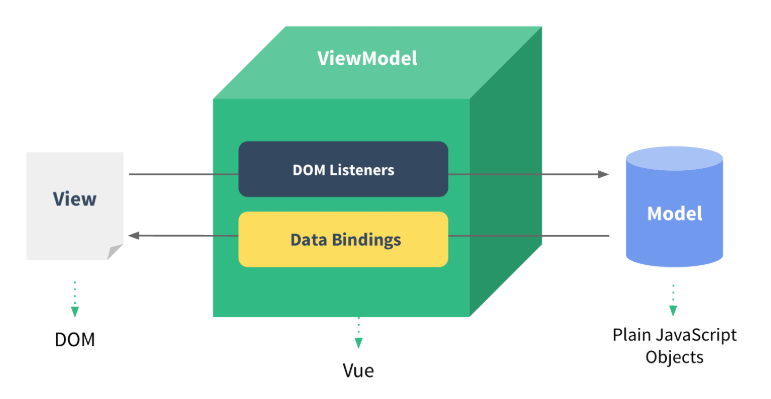
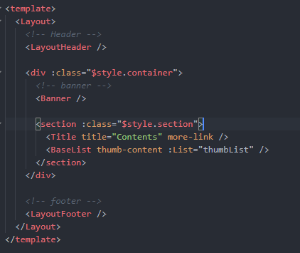
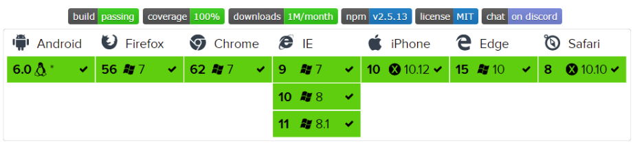

# Vue

<a href="https://kr.vuejs.org/v2/guide/index.html" target="_blank">한글 가이드</a>

## Vue.js

창시자는 에반유(Evan You) 이며 2014년 릴리즈 시작으로 꾸준히 발전하고 있는 프레임워크이다. 
구글에서 일하던 에반유는 앵귤러로 작업을 했는데.. 앵귤러를 이해하기 위해서는 방대한 크기의 프레임워크 구조를 이해했어야만 했음.  
그래서 앵귤러를 더 가볍게 쓰고 싶어서 앵귤러의 데이터 바인딩과 필수 요소들을 가지고 만든게 -> vue 

- 웹 개발을 위한 프런트엔드 프레임워크
- 뷰 코어 라이브러리는 화면단 데이터 표현에 관한 기능들을 중점적으로 지원. (view에 최적화된 프레임워크)
- 프레임워크의 기능인 라우터, 상태관리, 테스팅 등을 쉽게 결합할 수 있는 형태로 제공.

### 장점
1. 배우기 쉽다.
2. 리액트와 앵귤러에 비해 성능이 우수하다.
3. 리액트의 가상돔과 앵귤러의 데이터 바인딩 의 장점을 가지고 있다.

### 특징
#### 1. UI화면단 라이브러리 
UI 화면 개발 방법 중 MVVM 패턴을 사용.  
=> 프런트엔드 로직과 백엔드 로직을 분리하여 깔금하게 코드 구성.

 

 

모델(model) - 뷰(view) - 뷰모델(ViewModel) 로 구조화하여 개발하는 방식
- View : 사용자에게 보이는 화면.
- DOM : HTML 문서에 들어가는 요소의 정보는 담고 있는 트리
- DOM Listener : 돔 변경 내역에 대한 즉각 반응하여 특정 로직을 실행하는 장치
- Model : 데이터를 담는 용기. 서버에서 데이터 가져와서 자바스크립트 객체 형태로 저장.
- Data Binding : View 에 표시되는 내용과 모델의 데이터를 동기화.
- ViewModel : 뷰와 모델의 중간 영역. 돔 리스너와 데이터 바인딩을 제공.

> 웹 디자인 패턴 
> MVC, MVVM, MVP 패턴들이 있다. 
> 디자인 패턴은 건축으로치면 공법에 해당하는 것으로 소프트웨어의 개발 방법을 공식화 한 것이다.  
소수의 뛰어난 엔지니어가 해결한 문제를 다수의 엔지니어들이 처리 할 수 있도록 한 규칙이면서, 구현자들 간의 커뮤니케이션의 효율성을 높이는 기법이다.  
-위키피디아/ 참고 url (https://beomy.tistory.com/43)
>

 

#### 2. 컴포넌트 기반 프레임워크!

컴포넌트 = 레고블럭 
리액트, 앵귤러 모드 컴포넌트 기반 개발 방식.

 

##### 사용이유?

- 코드 재상하기 쉬움
- HTMML 코드에서 화면 구조를 직관적으로 파악하기 쉬움. 
   
  레이아웃은 Header / container / Footer 로 되어 있고, 
  container 안에는 Banner/Title/List가 쓰인것을 쉽게 알 수 있다.

 
 

### 지원 브라우저

 

#### 다른 프레임워크와 비교
<a href="https://kr.vuejs.org/v2/guide/comparison.html">다른 프레임워크와 비교</a>

참고 url
- [공식 페이지](https://kr.vuejs.org/v2/guide/index.html)
- <a href="https://k39335.tistory.com/60?category=701079">참고1</a>
- <a href="https://joshua1988.github.io/web-development/vuejs/vuejs-tutorial-for-beginner/#vuejs%EB%9E%80-%EB%AC%B4%EC%97%87%EC%9D%B8%EA%B0%80">참고2</a>
- <a href="https://meetup.toast.com/posts/99">참고3</a>
